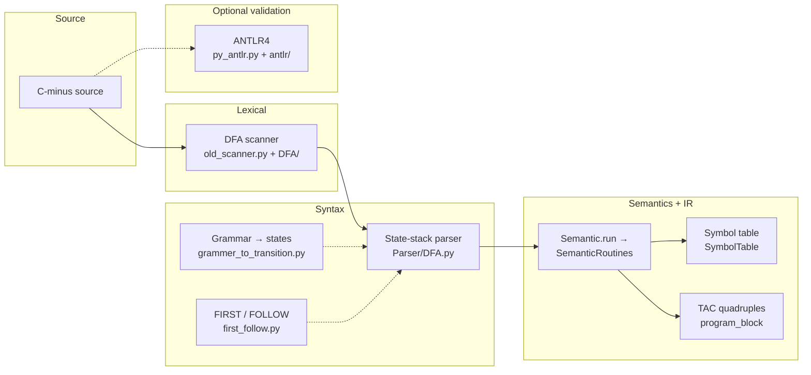
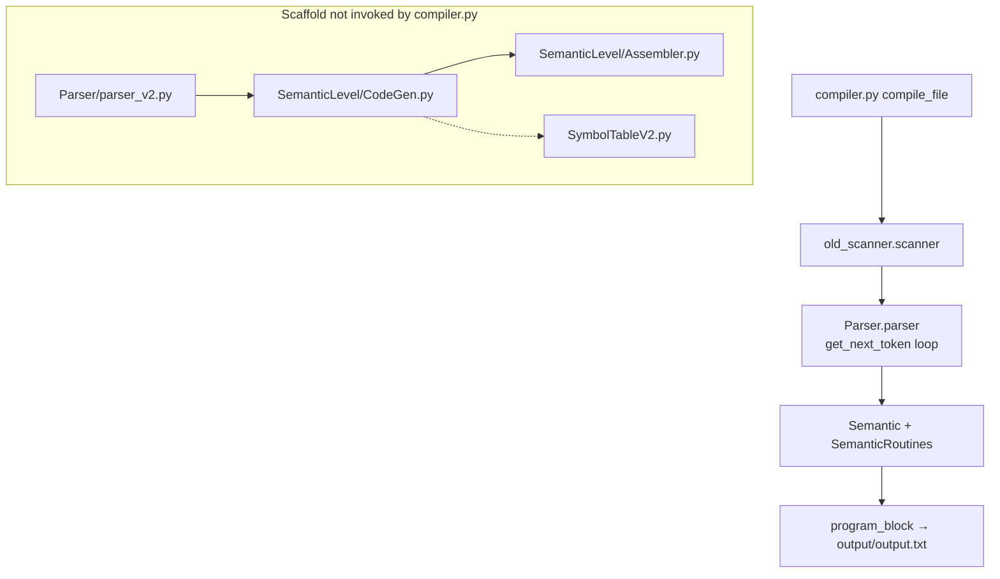
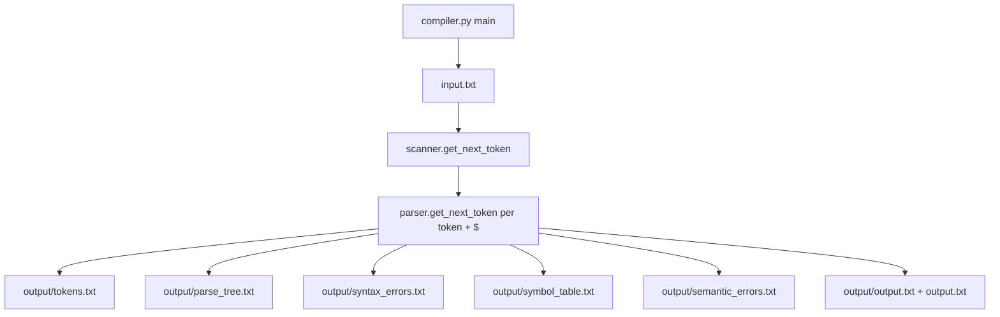
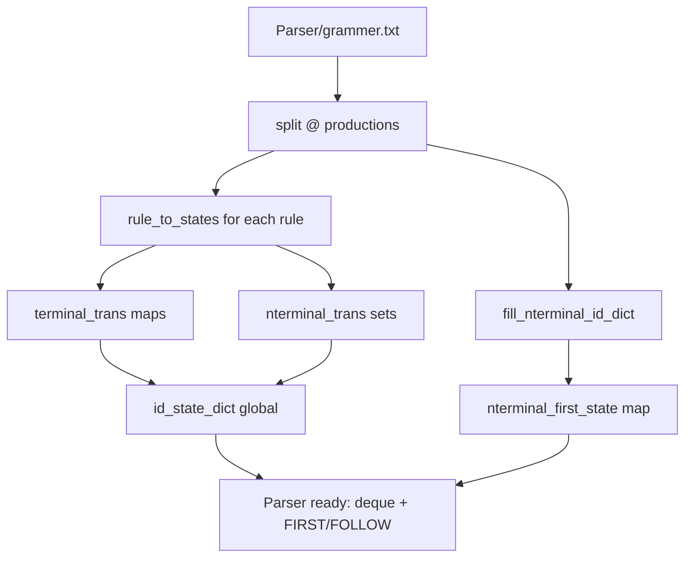
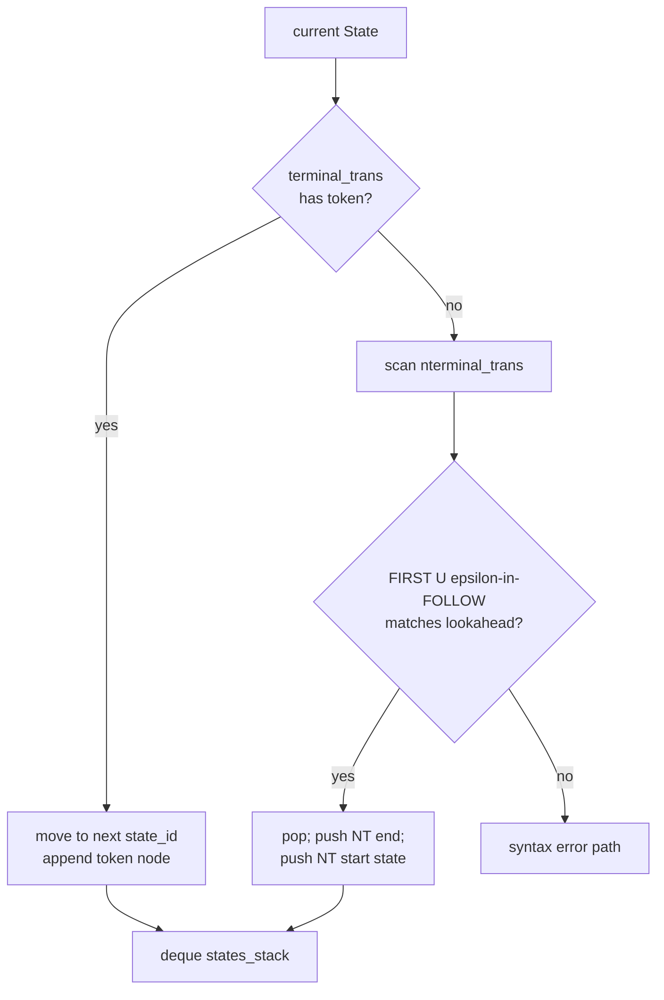
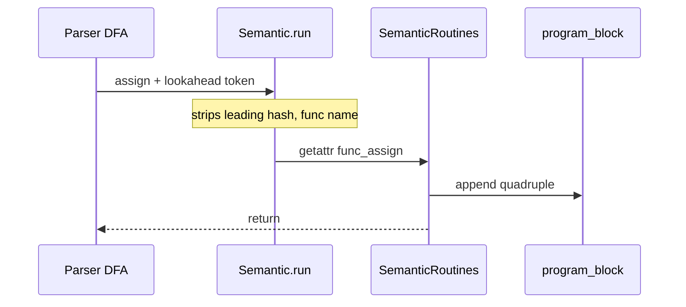
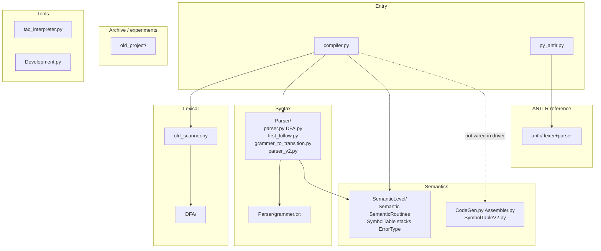
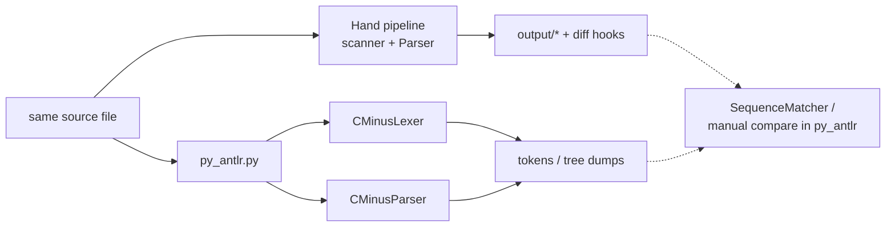

# C-minus Compiler

Full front end for the **C-minus** teaching language: a deterministic scanner, a FIRST/FOLLOW–guided predictive parser with explicit parse-tree construction, scoped semantic analysis and diagnostics, quadruple-style three-address code (`SemanticRoutines` / `program_block`), and an optional ANTLR4 reference pipeline. This branch also contains a **parallel, in-progress refactor** toward centralized codegen (`SemanticLevel/CodeGen.py`, `Assembler.py`, `Parser/parser_v2.py`, `SymbolTableV2.py`) and archived experiments under `old_project/`.

## Methodology

- **Lexical analysis:** Table-driven scanner over explicit scanner states (`DFA/states_trans.py`, `DFA/DFA.py`); tokenization is a deterministic finite automaton walk, not a third-party lexer, for the core pipeline.
- **Grammar → parser states:** Productions from `Parser/grammer.txt` are expanded into a network of parser `State` objects (`Parser/grammer_to_transition.py`); each state carries terminal and nonterminal transitions.
- **Predictive (LL(1)-style) parsing:** Nonterminal expansion is gated by **FIRST** / **FOLLOW** sets (`Parser/first_follow.py`) against the current lookahead; a **deque** holds active parser states (`Parser/DFA.py`), with **anytree** used to materialize the concrete syntax tree for inspection.
- **Syntax-directed translation (default driver):** The grammar embeds **action symbols** (`#…`); `Parser/parser.py` drives `Semantic.run`, which dispatches to `func_<name>` in `SemanticLevel/SemanticRoutines.py` during the same pass as parsing. `compiler.py` imports this path and serializes `program_block` to `output/output.txt` and root `output.txt`.
- **Semantic analysis:** Scoped **symbol table** (`SemanticLevel/SymbolTable.py`), explicit error taxonomy (`SemanticLevel/ErrorType.py`), and auxiliary stacks for control flow, calls, and temporaries (`SemanticLevel/stacks.py`).
- **Intermediate code (production):** Quadruple-style **TAC** accumulated in `program_block`; **TempManager** (`Semantic.py`) allocates word-aligned temporaries; call sequences use snapshot/restore of live variables and critical temporaries (`SemanticRoutines` + `stacks.py`).
- **Centralized codegen (scaffold, not wired to `compiler.py`):** `SemanticLevel/CodeGen.py` maps a subset of `#` actions to routines backed by `SemanticLevel/Assembler.py` (`OPCode`, formatted quadruples). `Parser/parser_v2.py` sketches action dispatch over symbol streams. `SemanticLevel/SymbolTableV2.py` is a parallel symbol-table design surface. `old_project/` holds legacy/experimental codegen and runtime material retained for reference.
- **External cross-check (optional):** ANTLR4 grammar and generated lexer/parser under `antlr/`, orchestrated by `py_antlr.py`, for token/tree comparison against the hand-built front end.

The codebase is intentionally **large and tightly coupled** on the production path (scanner tokens, grammar layout, action placement, and semantic routines must stay consistent). The refactor files add a second axis of change until they replace or merge with the default pipeline.

### Pipeline (conceptual dataflow)



### Default driver vs centralized codegen scaffold

`compiler.py` only exercises the left branch today. The right branch is present for incremental migration, not as the shipped driver.



### Driver, loop, and output artifacts

`compiler.py` copies the CLI path to `input.txt` (expected by `Parser/parser.py` initialization), runs the scanner/parser loop, then serializes results.



### Grammar file to parser automaton (import-time build)

Productions are read once at interpreter import; each rule becomes a chain of `State` instances wired by `grammer_to_transition.py`.



### Parse step: terminal read vs nonterminal expansion

Simplified from `State.next_state` in `Parser/DFA.py`: either consume a terminal edge, or push the sub-automaton for a nonterminal whose FIRST/FOLLOW predicates match the lookahead.



### Syntax-directed translation dispatch

When the grammar embeds an action symbol, the parser invokes `Semantic.run`; routines live as `func_<name>` in `SemanticRoutines` and mutate `program_block`, the symbol table, and auxiliary stacks.



### Repository layout (major Python surfaces)



### Optional ANTLR cross-check



## Technologies Used

- **Language:** Python 3 (project historically targets 3.7+; use a current 3.x release).
- **Core libraries:** `anytree` (parse tree rendering); standard library (`argparse`, `collections.deque`, `enum`, `re`, `subprocess`, …).
- **Reference tooling:** `antlr4-python3-runtime`; **Java** + ANTLR tooling when regenerating or deeply exercising `py_antlr.py`.
- **Engineering:** `pre-commit` hooks — **Ruff** (lint/format), **darglint**, **detect-secrets**, **Commitizen** (commit-msg).

## Features

- Tokenizes C-minus with a hand-specified scanner DFA; writes `output/tokens.txt`.
- Parses with grammar-derived automata and FIRST/FOLLOW–guided transitions; writes `output/parse_tree.txt` and `output/syntax_errors.txt`.
- Semantic pass covers scopes, declarations, arrays, calls, and control flow; writes `output/semantic_errors.txt` and `output/symbol_table.txt`.
- On success, emits quadruple-style TAC to `output/output.txt` and root `output.txt`; `Tools/tac_interpreter.py` executes TAC for validation.
- CLI flags: `--verbose`, `--phase3-mandatory` (subset enforced in `Tools/Development.py`), `--antlr` (reference pipeline via `py_antlr.py`).
- Additional directories for coursework and regression: `testcases/`, `Testcases1/`, `Testcases2/`, `Testcases2-pr/`, `Testcases3/`.

## Quick Start

```bash
git clone https://github.com/0ALI0ZARGAR0/compiler.git && cd compiler
pip install anytree antlr4-python3-runtime
python compiler.py testcases/T1/input.txt
```

Optional: `python Tools/tac_interpreter.py output/output.txt` to execute generated TAC when compilation is semantically clean. For ANTLR-heavy workflows, install a JDK and ensure ANTLR is available as expected by `py_antlr.py`.

*Branch topology (local):* `origin/main` is at `7b8a375`; local `main` is one commit ahead at `640a62e` (codegen scaffold + parser/semantic edits). A detached README-only chain ending at `72dd038` was preserved as `readme-detached-archive` for comparison. Treat **`main` @ `640a62e`** plus this file as the codebase–README pair you want on disk.
