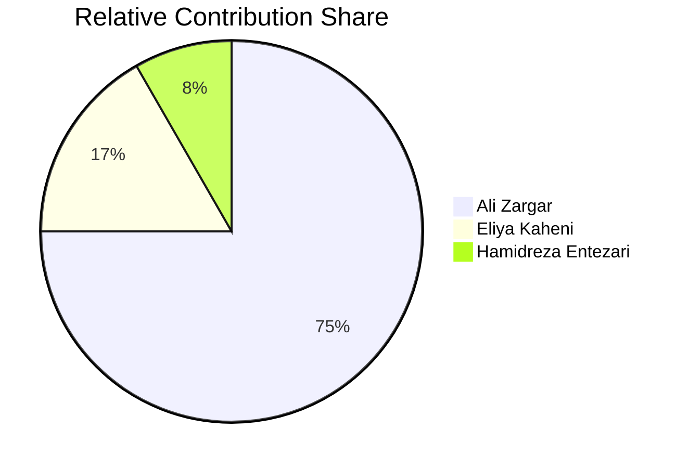
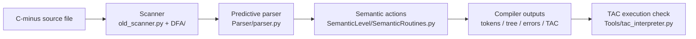
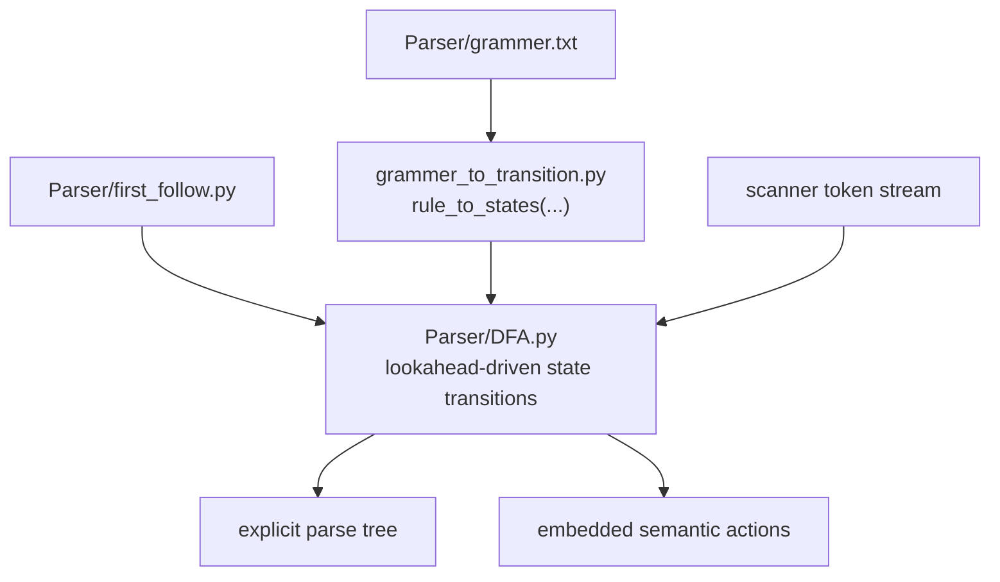
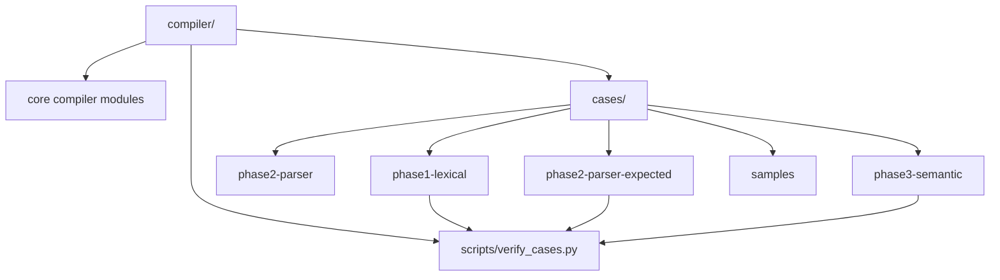

# C-minus Compiler
Hand-written compiler for the C-minus teaching language with DFA-based lexical analysis, FIRST/FOLLOW-guided predictive parsing, semantic checking, and quadruple-style intermediate code generation.

## Academic Context / Methodology

- Primary pipeline is generator-independent: scanner, parser, semantic routines, and IR emission are implemented manually rather than delegated to a compiler framework.
- Lexical analysis is implemented as an explicit deterministic finite automaton over handcrafted transition tables in `DFA/` and `old_scanner.py`.
- Syntax analysis is implemented as a predictive parser: grammar productions from `Parser/grammer.txt` are converted into parser states in `Parser/grammer_to_transition.py`, and lookahead decisions are constrained by precomputed FIRST/FOLLOW sets in `Parser/first_follow.py`.
- Semantic processing is syntax-directed: action symbols embedded in the grammar dispatch routines in `SemanticLevel/SemanticRoutines.py` during parsing.
- Semantic state is managed through a scoped symbol table, auxiliary stacks, backpatching for control flow, and a quadruple-form three-address code buffer (`program_block`).
- `antlr/` and `py_antlr.py` provide a separate ANTLR-based reference path for comparison, but the maintained compiler path is the hand-built frontend.

## Technologies Used

- Standard library: `argparse`, `collections.deque`, `contextlib`, `pathlib`, `re`, `shutil`, `subprocess`
- `anytree` for parse-tree rendering
- `antlr4-python3-runtime` for the optional ANTLR reference flow
- Mermaid for architecture documentation

## Features

- Compiles C-minus source into tokens, lexical errors, parse tree, syntax errors, semantic errors, symbol table output, and three-address code.
- Supports declarations, arrays, expressions, `if/else`, `repeat-until`, `while`, `return`, function declarations, function calls, and `output`.
- Generates quadruple-style TAC and includes a local TAC interpreter in `Tools/tac_interpreter.py` for execution checks.
- Organizes the project’s phased coursework and regression assets under `cases/` and includes a repeatable verification script in `scripts/verify_cases.py`.
- Keeps an ANTLR grammar and runtime path for secondary validation without replacing the main handwritten compiler path.

## Quick Start / Reproducibility

```bash
git clone https://github.com/0ALI0ZARGAR0/compiler.git && cd compiler
python3 -m venv .venv && . .venv/bin/activate && pip install anytree antlr4-python3-runtime
python3 compiler.py cases/phase3-semantic/Test6/input.txt && python3 scripts/verify_cases.py
```

The first command clones the repository, the second installs the runtime dependencies, and the third both runs a representative semantic/code-generation case and executes the project’s phase-level verification script.

## Contributor Overview

This section is auto-generated from repository commit history by `scripts/update_contributor_overview.py`. It uses an alias map so contributor identities remain merged consistently across different commit emails.

<!-- contributor-overview:start -->
Auto-generated from current branch history.

| Contributor | Share |
| --- | ---: |
| [Ali Zargar](https://github.com/0ALI0ZARGAR0) | 75.0% |
| [Eliya Kaheni](https://github.com/EliyaKaheni) | 16.7% |
| [Hamidreza Entezari](https://github.com/hamidrezaen) | 8.3% |



[Open GitHub contributors graph](https://github.com/0ALI0ZARGAR0/compiler/graphs/contributors)
<!-- contributor-overview:end -->

## Mermaid Diagrams

GitHub renders the Mermaid blocks below visually in the README. The source for the same diagrams is kept under `docs/diagrams/`.

### Compilation Pipeline



### Parser Construction Path



### Repository and Verification Structure



